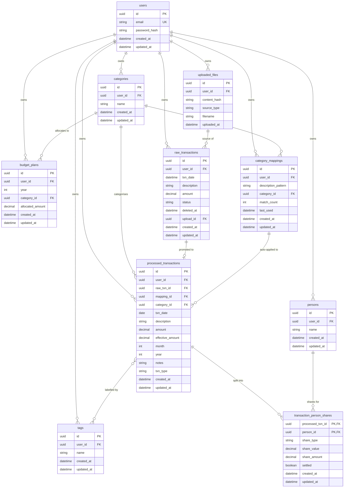

# Database

The backend uses PostgreSQL (Supabase in production, plain local Postgres in dev). All schema changes go through Alembic — `Base.metadata.create_all` is **never** used outside tests.

## Entity-relationship diagram



## Tables

| Table | Purpose | Key constraints |
|---|---|---|
| `users` | One row per registered account. `email` is unique and stored lower-cased. | `email UNIQUE` |
| `categories` | Small set of stable buckets used for budgeting. Renaming is in-place — FK references stay valid. | `(user_id, name) UNIQUE` |
| `tags` | Free-form labels orthogonal to categories. | `(user_id, name) UNIQUE` |
| `persons` | People you split expenses with. | `(user_id, name) UNIQUE` |
| `budget_plans` | Annual allocation per category per year. `allocated_amount` is **annual**. | One plan per `(user_id, year, category_id)` enforced in application code; UQ at DB level via the same composite. |
| `raw_transactions` | Holding area populated by `/uploads/*`. Soft-deleted, never hard-deleted. | `status ∈ {pending, processed, deleted}`, index on `(user_id, status)`. |
| `processed_transactions` | The analytics-ready table. Has both `amount` (statement total) and `effective_amount` (after subtracting other people's shares). | Indexed on `(user_id, year, month)` and `(category_id, txn_date)`. |
| `category_mappings` | Learned `description_pattern → category` rules. `match_count` and `last_used` are touched on every match for usage analytics. | `(user_id, description_pattern) UNIQUE`. |
| `transaction_person_shares` | Junction table for splits. Composite PK on `(processed_txn_id, person_id)`. `share_type` is `percentage` or `amount`; `share_amount` is always the computed currency value (denormalised for query speed). | `CASCADE` on both FKs. |
| `transaction_tags` | Many-to-many between processed transactions and tags. | Composite PK; both FKs `CASCADE`. |
| `uploaded_files` | SHA-256 of every imported file or text blob. Used by `/uploads/*` for duplicate detection. | `(user_id, content_hash) UNIQUE`. |

## Conventions

- **Primary keys** are `uuid.uuid4` generated client-side (in `default=uuid.uuid4` on the column). This keeps inserts cheap and lets the client know the ID before the round-trip.
- **Timestamps** — every domain table mixes in `TimestampMixin`, which adds `created_at` (default now) and `updated_at` (default now + `onupdate=now`). `uploaded_files` opts out because it is write-once.
- **Currency** — every monetary column is `Numeric(12, 2)`. Never use `Float` for money.
- **Soft delete** lives only on `raw_transactions` (`status='deleted'` + `deleted_at`). Other tables hard-delete or block deletion via `409` when there are referencing rows.
- **`user_id` scoping** — every domain table has a top-level `user_id` column, even when it could be reached transitively. Every query joins on `user_id` first to avoid cross-user data leaks; there is no row-level security at the database layer.

## Migrations workflow

```bash
# After editing app/models.py:
alembic revision --autogenerate -m "describe the change"

# Review alembic/versions/<sha>_describe_the_change.py
# (autogenerate is not perfect — fix column types, defaults, indexes by hand if needed)

alembic upgrade head     # apply locally
```

When merging:

1. Pull main, run `alembic upgrade head` against your local DB.
2. Resolve migration conflicts by re-running `alembic revision --autogenerate` on top of main's head, then deleting your old revision file.
3. Never edit a migration that has been applied to a shared environment (staging, prod). Add a new one that fixes whatever needs fixing.

### Common gotchas

- **Postgres enums** — Alembic does not always drop them when you remove a column. If `alembic upgrade head` fails on a type already existing, drop the enum manually in a hand-written revision.
- **Index renames** — `autogenerate` will sometimes emit `drop + create`. Fold to a single `alter_index` to avoid downtime on the prod DB.
- **`Numeric` precision** changes — must use `op.alter_column(..., type_=Numeric(N, D))` explicitly; autogenerate may miss it.

## Querying patterns

```python
# Always scope by user_id first.
db.execute(
    select(ProcessedTransaction)
    .where(ProcessedTransaction.user_id == user_id)
    .where(ProcessedTransaction.year == year, ProcessedTransaction.month == month)
)

# Exactly-one-or-none reads use scalar_one_or_none() so missing rows are explicit.
cat = db.execute(
    select(Category).where(Category.id == cid, Category.user_id == user_id)
).scalar_one_or_none()
if cat is None:
    raise HTTPException(404, "Category not found")
```

## Related documents

- [`ARCHITECTURE.md`](ARCHITECTURE.md) — module layout and request lifecycle
- [`API.md`](API.md) — endpoint reference
